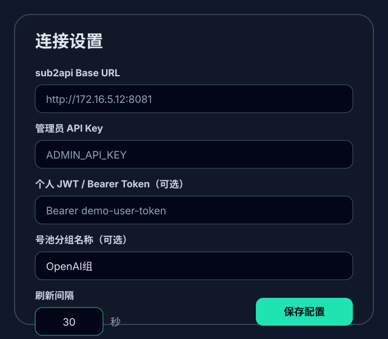
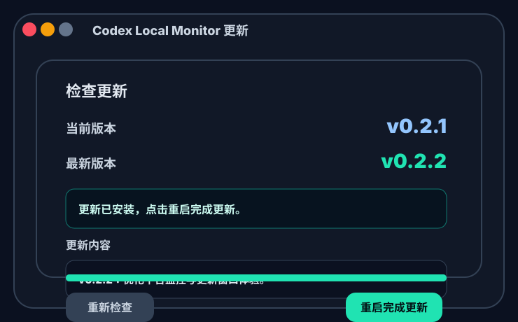

# Codex Local Monitor

[](https://github.com/Luociqvq/codex-local-monitor/releases)
[](https://github.com/Luociqvq/codex-local-monitor/actions/workflows/release.yml)
[](https://v2.tauri.app/)

**Codex Local Monitor 是一个 Codex 本地桌面插件。** 它通过紧凑悬浮岛持续读取你自己的 [sub2api](https://github.com/Wei-Shaw/sub2api) 或 [CLIProxyAPI](https://github.com/router-for-me/CLIProxyAPI)（简称 CPA）实例，集中展示 Codex 相关用量、费用、请求、账号池、服务健康和并发状态。

sub2api 与 CPA / CLIProxyAPI 是可切换的数据源，不是产品名称。所有请求都由桌面客户端直连你填写的服务地址，不经过作者服务器或任何第三方中转。

## 界面预览

> 预览图使用模拟数据，不包含真实服务器地址或凭据。

### 平台监控


### 个人用量


### 连接设置



### 应用更新



## 数据源能力

| 能力 | sub2api | CPA / CLIProxyAPI |
| --- | :---: | :---: |
| 个人 Token 与费用 | ✓ | — |
| 平台用量与请求延迟 | ✓ | — |
| 账号池与配额余量 | ✓ | 账号文件状态 |
| 服务健康 | CPU、内存、延迟、运行时长 | 健康检查、请求与失败累计 |
| OpenAI / Codex 并发 | ✓ | — |
| 只读访问 | ✓ | ✓ |

CLIProxyAPI v6.10+ 已移除内置 Token 用量统计，因此 CPA 模式展示服务健康、请求累计和账户状态，不推算或伪造 Token 与费用。Codex 并发数据来自 sub2api Ops 接口，不是 Codex Desktop 的本地任务列表。

## 主要功能

- 在 sub2api 和 CPA / CLIProxyAPI 之间快速切换。
- 展示今日 Token、实际金额、最近请求延迟与累计请求。
- 汇总账号池可用数量、异常状态和配额余量。
- 监控 CPU、内存、接口延迟、运行时间与服务健康。
- 查看 OpenAI / Codex 请求的运行数和排队数。
- 支持悬浮岛自动收起、固定展开、窗口置顶与托盘菜单。
- 窗口隐藏时暂停后台轮询，重新显示后立即刷新。
- 通过 GitHub Releases 检查并安装更新。

## 安装

前往 [Releases](https://github.com/Luociqvq/codex-local-monitor/releases) 下载对应平台的安装包。

Windows 安装包：

- `Codex Local Monitor_VERSION_x64-setup.exe`：NSIS 安装程序。
- `Codex Local Monitor_VERSION_x64_en-US.msi`：MSI 安装包。

macOS 安装包由发布工作流生成。首次打开未签名的本地构建时，macOS 可能要求在“隐私与安全性”中确认。

从旧版本升级时，应用标识和本地设置键保持不变，原有服务器地址、数据源选择和界面偏好可以继续使用。

## 配置 sub2api

首次启动选择 `sub2api`，然后填写：

| 配置项 | 必填 | 说明 |
| --- | --- | --- |
| 服务器地址 | 是 | sub2api 根地址，例如 `http://127.0.0.1:8081` |
| 管理员 API Key | 二选一 | 读取平台、账号池、服务器和 Ops 指标 |
| 个人 Token | 二选一 | 读取当前用户的 Token 与费用 |
| 账号池分组 | 否 | 与 sub2api active 分组名一致；留空统计全部账号 |
| 刷新间隔 | 否 | 10–300 秒，默认 30 秒 |

管理员 API Key 和个人 Token 可以同时填写。保存前可使用“测试连接”检查地址和凭据。

## 配置 CPA / CLIProxyAPI

首次启动选择 `CPA / CLIProxyAPI`，然后填写：

| 配置项 | 必填 | 说明 |
| --- | --- | --- |
| 服务器地址 | 是 | CLIProxyAPI 根地址，例如 `http://127.0.0.1:8317` |
| Management Key | 是 | `remote-management.secret-key` 对应的明文密钥 |
| 刷新间隔 | 否 | 10–300 秒，默认 30 秒 |

跨主机读取 CPA 时需要在服务端启用 `remote-management.allow-remote`。公网或不受信任网络建议同时使用 HTTPS、反向代理访问控制或可信内网。

## 读取的接口

sub2api 模式会按已填写的凭据和服务能力读取：

```text
/api/v1/usage/dashboard/stats
/api/v1/usage?page=1&page_size=1&sort=created_at&order=desc
/api/v1/admin/dashboard/stats
/api/v1/admin/groups/all
/api/v1/admin/accounts
/api/v1/admin/groups/capacity-summary
/api/v1/admin/ops/dashboard/overview?time_range=5m
/api/v1/admin/ops/concurrency?platform=openai
```

Ops 接口属于可选能力；请求超时或服务端未启用时，不会阻断主面板刷新。

CPA / CLIProxyAPI 模式只读取：

```text
/healthz
/v0/management/auth-files
```

Management Key 通过 `Authorization: Bearer MANAGEMENT_KEY` 发送。插件不会调用可能弹出队列数据的 `/v0/management/usage-queue`，也不会写入配置、修改账户或执行管理操作。

## 隐私与安全

- 服务器地址和凭据保存在本机 WebView 存储中。
- 凭据只发送到你在设置中填写的 sub2api 或 CPA 地址。
- 项目不包含分析、遥测、广告或第三方数据中转。
- 仓库不包含作者或用户的服务器地址、API Key、Token、Management Key 等运行配置。
- 推荐为远程服务启用 HTTPS，并定期轮换所有访问凭据。

## 本地开发

环境要求：

- Node.js 20+
- Rust stable
- Tauri 2 对应的[系统依赖](https://v2.tauri.app/start/prerequisites/)

```bash
git clone https://github.com/Luociqvq/codex-local-monitor.git
cd codex-local-monitor
npm install
npm run desktop
```

常用命令：

```bash
npm run dev       # 启动前端开发服务器
npm test          # 运行前端和发布脚本测试
npm run build     # 类型检查并构建前端
npm run desktop   # 启动 Tauri 桌面应用
```

构建 Windows 安装包：

```bash
npm run tauri build -- --config src-tauri/tauri.local-build.conf.json
```

本地覆盖配置会关闭 updater 产物生成，适合验证安装包；正式发布使用默认 Tauri 配置。

## 发布

版本号和更新说明以 `package.json` 为单一来源：

```bash
npm run release:sync
npm test
npm run build
npm run release:tag
git push origin main --follow-tags
```

推送 `v*` 标签后，GitHub Actions 会构建 Windows 和 macOS 安装包并创建 Release。自动更新签名需要在仓库 Secrets 中配置 `TAURI_SIGNING_PRIVATE_KEY` 与 `TAURI_SIGNING_PRIVATE_KEY_PASSWORD`。

## 技术栈

- Vue 3 + TypeScript + Vite
- Tauri 2 + Rust
- Vitest
